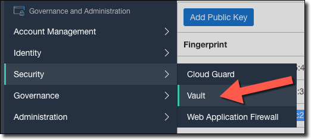
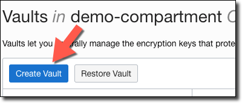
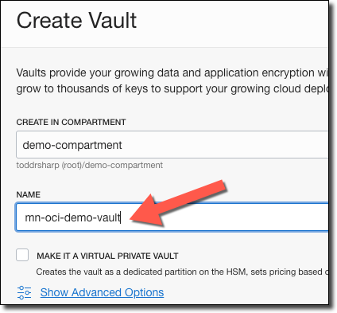
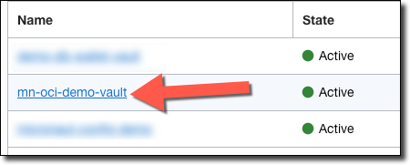
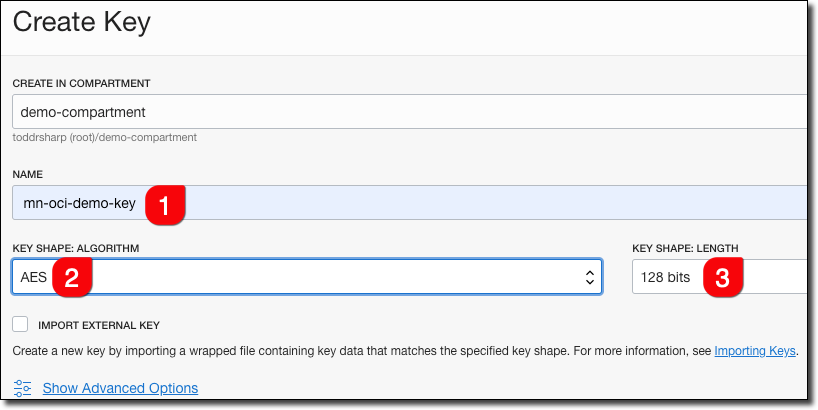
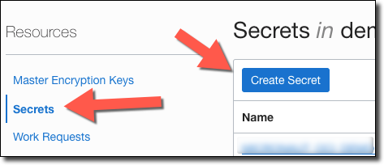
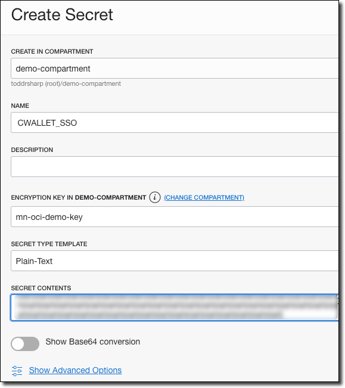
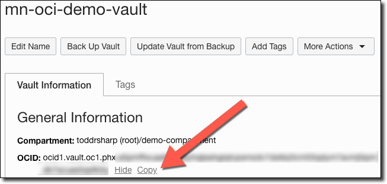

# Micronaut Data JDBC Graal Autonomous DB 

Test application for Micronaut Data JDBC and GraalVM that uses Oracle Autonomous DB.

## Pre-Requesites

1. Java 11+ installed
2. Micronaut installed
3. OCI Config file created at `~/.oci/config` per https://docs.cloud.oracle.com/en-us/iaas/Content/API/Concepts/sdkconfig.htm
4. Autonomous DB (ATP) instance created

## Setup

### Create Schema in ATP

```sql
CREATE USER mnocidemo IDENTIFIED BY "$trongPassw0rd"; 
GRANT CONNECT, RESOURCE TO mnocidemo; 
GRANT UNLIMITED TABLESPACE TO mnocidemo;
```

### Secrets

Download your ATP wallet to your local machine. We'll first need to Base64 encode the wallet contents.

See `scripts/encode-wallet.sh` for an example script to help you do this. Make it executable and call it like so:

```shell script
$ chmod +x encode-wallet.sh
$ ./encode-wallet.sh /tmp/path/to/output /path/to/unzipped/wallet
```

This will produce output similar to this:

```shell script
writing /tmp/wallet/cwallet.sso
writing /tmp/wallet/ewallet.p12
writing /tmp/wallet/keystore.jks
writing /tmp/wallet/ojdbc.properties
writing /tmp/wallet/sqlnet.ora
writing /tmp/wallet/tnsnames.ora
writing /tmp/wallet/truststore.jks
```

Next, you'll need to create a vault that will be used to store the wallet contents as well as the DB password.

Select Security -> Vault:



Click 'Create Vault'.



Name it, then click 'Create Vault'.



When your vault is active, click on it to view the vault details.



In the vault details, click 'Create Key'.


Name the key (1), choose the algorithm (2) and shape (3).



Still within the vault details, click 'Secrets' in the left sidebar, then click 'Create Secret'.



Create a separate secret for every Base64 encoded file in your wallet. Use the names [shown below](#wallet-files) for each secret.



#### Wallet Files

| File              |
| :---              |
| TRUSTSTORE_JKS    |
| TNSNAMES_ORA      |
| SQLNET_ORA        |
| OJDBC_PROPERTIES  |
| KEYSTORE_JKS      |
| EWALLET_P12       |
| CWALLET_SSO       |

Create one more secret in this vault, this one containing your DB password that you created earlier. Name it `MICRONAUT_OCI_DEMO_PASSWORD`.

Copy the OCID of your vault.



### Config
       
Create a file located at `src/main/resources/bootstrap.yml`. Populate as such, substituting your vault OCID and the compartment OCID in which the vault was created.

```yaml
micronaut:
  application:
    name: micronaut-data-jdbc-graal-atp
  config-client:
    enabled: true
oraclecloud:
  vault:
    config:
      enabled: true
    vaults:
      - ocid: ocid1.vault.oc1.phx.[Vault OCID]
        compartment-ocid: ocid1.compartment.oc1..[Compartment OCID]
    use-instance-principal: false
    path-to-config: ~/.oci/config
    profile: NO_PASSPHRASE
    region: US-PHOENIX-1
```

Development Note: This will require `~/.oci/config` to exist on VM if we deploy to cloud. Optionally, we could create a `bootstrap-prod.yml` to specify Instance Principal auth and use that in prod with `-Dmicronaut.bootstrap.name`, but that would require the extra work of setting up Instance Principal auth via dynamic groups and policies.

Modify `src/main/resources/application.yml` to update the datasource URL:

```yaml
datasources:
  default:
    url: jdbc:oracle:thin:@[YOUR TNS NAME FROM WALLET TNSNAMES.ORA]?TNS_ADMIN=/tmp/demo-wallet
    driverClassName: oracle.jdbc.OracleDriver
    username: mnocidemo
    password: ${MICRONAUT_OCI_DEMO_PASSWORD}
    schema-generate: CREATE_DROP
    dialect: ORACLE
```

**Note:** Do not change the path to the Wallet in the URL above.

The Micronaut OCI Vault Distributed Configuration support will download your decrypted secrets at runtime and inject them into your application as configuration variables with names that match the secret name. Therefore, your password will be properly injected into your datasource given that you created a secret in the vault above with the name `MICRONAUT_OCI_DEMO_PASSWORD` per the instructions.

Also, notice the following block in `src/main/resources/application.yml`:

```yaml
wallet:
  TRUSTSTORE_JKS: ${TRUSTSTORE_JKS}
  TNSNAMES_ORA: ${TNSNAMES_ORA}
  SQLNET_ORA: ${SQLNET_ORA}
  OJDBC_PROPERTIES: ${OJDBC_PROPERTIES}
  KEYSTORE_JKS: ${KEYSTORE_JKS}
  EWALLET_P12: ${EWALLET_P12}
  CWALLET_SSO: ${CWALLET_SSO} 
```

Now check `src/main/java/WalletConfig.java` - this typed configuration will be available at runtime to be injected where necessary.

Your wallet will be available at runtime at `/tmp/demo-wallet` if you have followed the steps above.

## Run

With:

```shell script
$ ./gradlew run
```

Should result in similar output:

```shell script
18:20:33.622 [main] INFO  i.m.context.DefaultBeanContext - Reading Startup environment from bootstrap.yml
18:20:34.503 [main] INFO  com.oracle.bmc.Services - Registering new service: Services.BasicService(serviceName=SECRETS, serviceEndpointPrefix=, serviceEndpointTemplate=https://secrets.vaults.{region}.oci.{secondLevelDomain})
18:20:34.538 [main] INFO  com.oracle.bmc.Region - Loaded service 'SECRETS' endpoint mappings: {US_PHOENIX_1=https://secrets.vaults.us-phoenix-1.oci.oraclecloud.com}
18:20:34.864 [main] INFO  com.oracle.bmc.util.JavaRuntimeUtils - Determined JRE version as Java_8
18:20:34.864 [main] INFO  c.o.bmc.http.DefaultConfigurator - Setting connector provider to HttpUrlConnectorProvider
18:20:34.903 [main] INFO  com.oracle.bmc.secrets.SecretsClient - Setting endpoint to https://secrets.vaults.us-phoenix-1.oci.oraclecloud.com
18:20:34.938 [main] INFO  com.oracle.bmc.secrets.SecretsClient - Authentication details provider configured for region 'US_PHOENIX_1', but endpoint specifically set to 'https://secrets.vaults.us-phoenix-1.oci.oraclecloud.com'. Using endpoint setting instead of region.
18:20:34.938 [main] INFO  com.oracle.bmc.secrets.SecretsClient - Setting endpoint to https://secrets.vaults.us-phoenix-1.oci.oraclecloud.com
18:20:34.942 [main] INFO  com.oracle.bmc.Services - Registering new service: Services.BasicService(serviceName=VAULTS, serviceEndpointPrefix=, serviceEndpointTemplate=https://vaults.{region}.oci.{secondLevelDomain})
18:20:34.943 [main] INFO  com.oracle.bmc.Region - Loaded service 'VAULTS' endpoint mappings: {US_PHOENIX_1=https://vaults.us-phoenix-1.oci.oraclecloud.com}
18:20:34.946 [main] INFO  c.o.bmc.http.DefaultConfigurator - Setting connector provider to HttpUrlConnectorProvider
18:20:34.951 [main] INFO  com.oracle.bmc.vault.VaultsClient - Setting endpoint to https://vaults.us-phoenix-1.oci.oraclecloud.com
18:20:34.951 [main] INFO  com.oracle.bmc.vault.VaultsClient - Authentication details provider configured for region 'US_PHOENIX_1', but endpoint specifically set to 'https://vaults.us-phoenix-1.oci.oraclecloud.com'. Using endpoint setting instead of region.
18:20:34.951 [main] INFO  com.oracle.bmc.vault.VaultsClient - Setting endpoint to https://vaults.us-phoenix-1.oci.oraclecloud.com
18:20:35.388 [main] INFO  com.oracle.bmc.ClientRuntime - Using SDK: Oracle-JavaSDK/1.19.4
18:20:35.389 [main] INFO  com.oracle.bmc.ClientRuntime - User agent set to: Oracle-JavaSDK/1.19.4 (Mac OS X/10.14.6; Java/1.8.0_252; OpenJDK 64-Bit Server VM GraalVM CE 20.1.0/25.252-b09-jvmci-20.1-b02)
18:20:38.664 [main] INFO  i.m.d.c.c.DistributedPropertySourceLocator - Resolved 1 configuration sources from client: compositeConfigurationClient(Retrieves secrets from Oracle Cloud vaults)
18:20:38.909 [main] INFO  com.zaxxer.hikari.HikariDataSource - HikariPool-1 - Starting...
18:20:40.616 [main] INFO  com.zaxxer.hikari.HikariDataSource - HikariPool-1 - Start completed.
18:20:40.636 [main] DEBUG io.micronaut.data.query - Dropping Table: 
DROP TABLE "OWNER";
18:20:40.776 [main] DEBUG io.micronaut.data.query - Dropping Table: 
DROP TABLE "PET";
18:20:40.889 [main] DEBUG io.micronaut.data.query - Executing CREATE statement: 
CREATE SEQUENCE "OWNER_SEQ" MINVALUE 1 START WITH 1 NOCACHE NOCYCLE
18:20:40.999 [main] WARN  io.micronaut.data.query - CREATE Statement Failed: ORA-00955: name is already used by an existing object

18:20:40.999 [main] DEBUG io.micronaut.data.query - Executing CREATE statement: 
CREATE TABLE "OWNER" ("ID" NUMBER(19) PRIMARY KEY NOT NULL,"AGE" NUMBER(10) NOT NULL,"NAME" VARCHAR(255) NOT NULL)
18:20:41.109 [main] WARN  io.micronaut.data.query - CREATE Statement Failed: ORA-00955: name is already used by an existing object

18:20:41.111 [main] DEBUG io.micronaut.data.query - Executing CREATE statement: 
CREATE TABLE "PET" ("ID" VARCHAR(36),"OWNER_ID" NUMBER(19),"NAME" VARCHAR(255) NOT NULL,"TYPE" VARCHAR(255) NOT NULL)
18:20:41.234 [main] WARN  io.micronaut.data.query - CREATE Statement Failed: ORA-00955: name is already used by an existing object

18:20:41.598 [main] INFO  example.Application - Populating data
18:20:41.923 [main] DEBUG io.micronaut.data.query - Executing Batch SQL Insert: INSERT INTO "OWNER" ("AGE","NAME","ID") VALUES (?,?,"OWNER_SEQ".nextval)
18:20:42.083 [main] DEBUG io.micronaut.data.query - Executing Batch SQL Insert: INSERT INTO "PET" ("OWNER_ID","NAME","TYPE","ID") VALUES (?,?,?,?)
18:20:42.508 [main] INFO  io.micronaut.runtime.Micronaut - Startup completed in 9111ms. Server Running: http://localhost:8080
```

## Build

With:

```shell script
$ ./gradlew assemble
```

Run the JAR with:

```shell script
$ java -jar build/libs/micronaut-data-jdbc-graal-atp-0.1-all.jar  
```

## Native Image

TODO: Populate, if we can get it to work...

## Deploy

TODO: Are we going to deploy?

## Test

When running locally:

```
curl localhost:8080/owners
curl localhost:8080/owners/Fred

curl localhost:8080/pets
curl localhost:8080/pets/Dino
```
