# Setup

Table of Contents
=================

  * [Setup OCI CLI Profile On Local Machine](#setup-oci-cli-profile-on-local-machine)
  * [Create an SSH Keypair](#create-an-ssh-keypair)
  * [Create Infrastructure](#create-infrastructure)
  * [Create DB Schema](#create-db-schema)
  * [Download Wallet (Locally)](#download-wallet-locally)
  * [Run Application (Locally)](#run-application-locally)
  * [Deploy (From Local To VM)](#deploy-from-local-to-vm)
  * [Destroy](#destroy)

## Setup OCI CLI & Profile On Local Machine

Follow instructions here:

Install CLI:

https://docs.cloud.oracle.com/en-us/iaas/Content/API/SDKDocs/cliinstall.htm

Create Profile:

https://docs.cloud.oracle.com/en-us/iaas/Content/Functions/Tasks/functionsconfigureocicli.htm

## Create an SSH Keypair

For example:

```shell script
ssh-keygen -t rsa -N "" -b 2048 -C "id_oci" -f ~/.ssh/id_oci
```

## Create Infrastructure

Download the latest Terraform configuration (stack.zip) from: 

https://github.com/recursivecodes/micronaut-data-jdbc-graal-atp/releases/latest/download/stack.zip

Go to the Resource Manager:

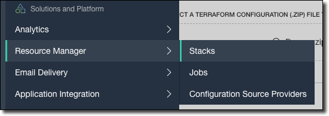

Click 'Create Stack':

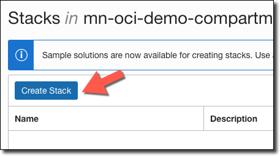

Choose 'My Configuration', and upload the configuration zip:

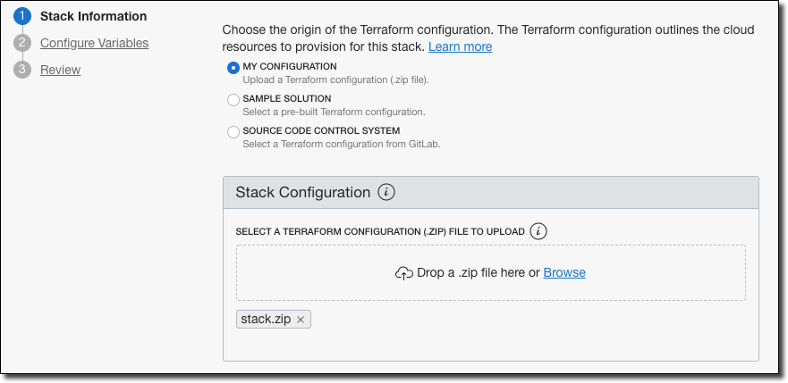

Enter name, description and choose the compartment, then click 'Next':

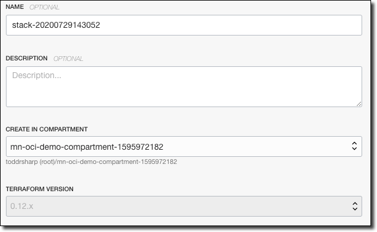

Add the SSH key that you [created earlier](#create-an-ssh-keypair):

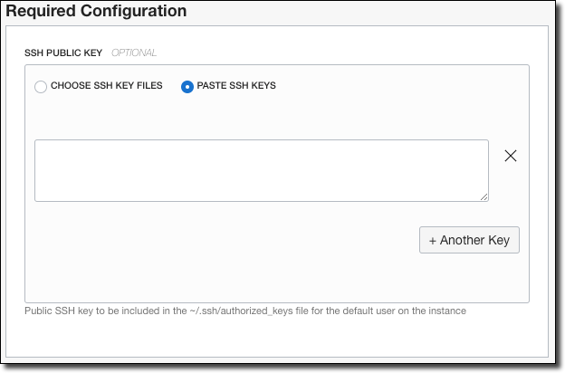

Confirm the following shape is selected:

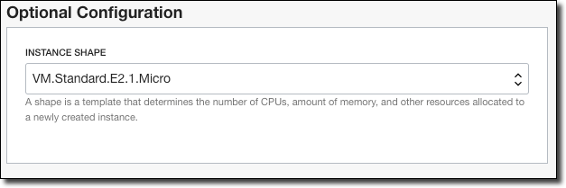

Click 'Next', review and create your stack.

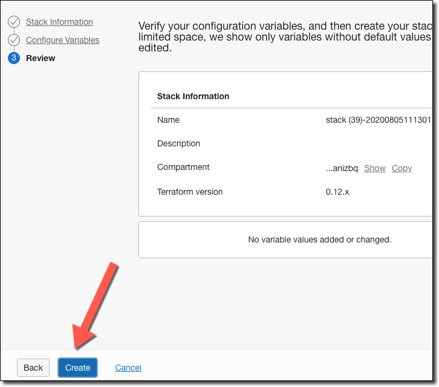

On the stack details page, click 'Terraform Actions' and select 'Plan'.

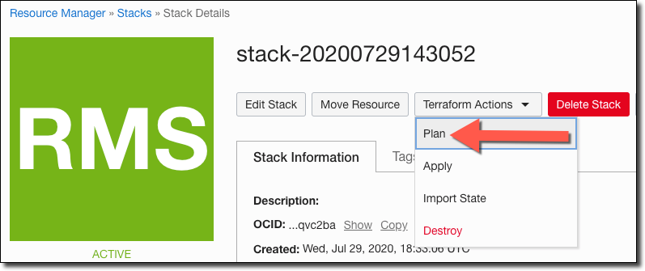

Review the plan output, ensure no failures.

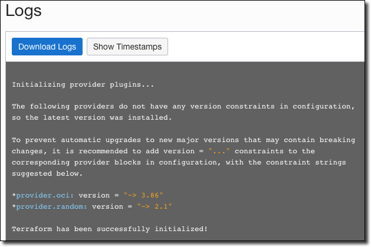

Click 'Terraform Actions' and select 'Apply'.

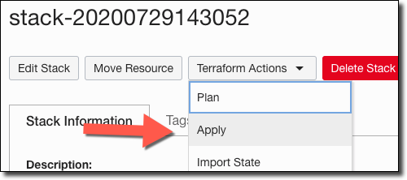

Choose the plan you just created, then click 'Apply'.

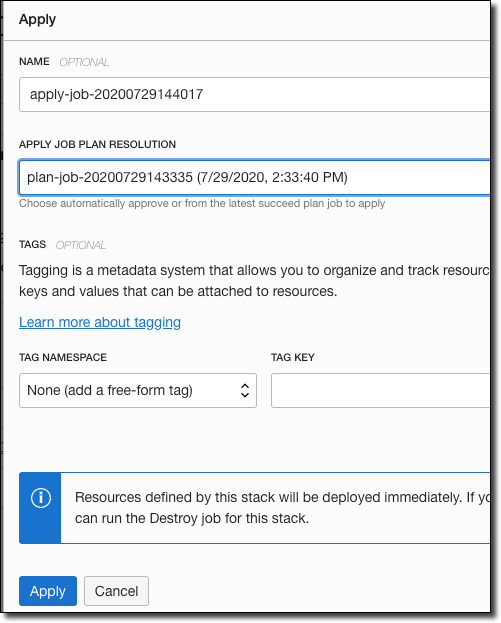

Review the output:

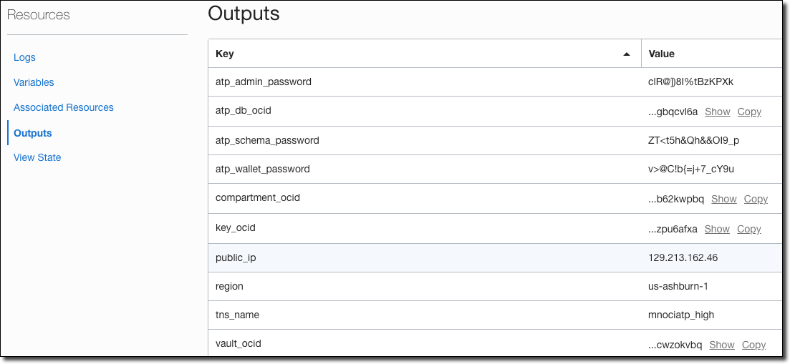

Collect the following values from the output:

* compartment_ocid
* tns_name
* atp_admin_password
* atp_schema_password
* atp_wallet_password
* atp_db_ocid
* region

**Note:** Java will be installed upon the first boot of the image. It will take 3-5 minutes to install, so it will not be *immediately* available in the VM.

## Create DB Schema

From Cloud Shell, download the following script, make it executable, and run it:

**Note:** If you did not [setup your OCI config](#setup-oci-cli-profile-on-local-machine) earlier, this step will not work.

```shell script
# run in Cloud Shell
wget -O setup.sh https://github.com/recursivecodes/micronaut-data-jdbc-graal-atp/releases/latest/download/setup.sh
chmod +x setup.sh
./setup.sh
```

Enter the values that you copied from the TF output when prompted. The script will produce several snippets of output to be used to build, run and deploy.

## Download Wallet (Locally)

The Cloud Shell script will produce a snippet to be used to download your ATP wallet to your local machine. It will look similar to this:

```shell script
# run on local machine
oci db autonomous-database generate-wallet --autonomous-database-id ocid1.autonomousdatabase.oc1.iad... --file /tmp/wallet.zip --password [DB PASSWORD] && unzip /tmp/wallet.zip -d /tmp/wallet
```

Run the script (above) immediately to set up your wallet.

## Run Application (Locally)
 
The snippet used to run your application locally. It will look similar to this:

```shell script
# run on local machine
./gradlew -DMICRONAUT_OCI_DEMO_PASSWORD [your generated password] run
```
## Deploy (From Local To VM)

Before deploying, ensure the wallet exists on the VM by running the snippet produced by `setup.sh` that looks similar to:

```shell script
# run on local machine to push to VM
scp -i ~/.ssh/id_oci -r /tmp/wallet opc@[VM IP Address]:/tmp/wallet
```

Build JAR with:

```shell script
# run on local machine
./gradlew assemble
```

Push JAR to VM with the snippet produced by `setup.sh` that looks similar to this:

```shell script
# run on local machine to push to VM
scp -i ~/.ssh/id_oci -r build/libs/micronaut-data-jdbc-graal-atp-0.1-all.jar opc@[VM IP Address]:/app
```

To run on the VM, SSH in and run the snippet generated by `setup.md` that looks similar to this:
```shell script
# run on VM to start application
java -jar -DMICRONAUT_OCI_DEMO_PASSWORD [your generated password] /app/micronaut-data-jdbc-graal-atp-0.1-all.jar
```

## Destroy

To clean up all of the OCI resources created by Terraform, run 'Destroy' on the stack:

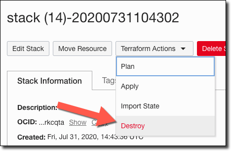
