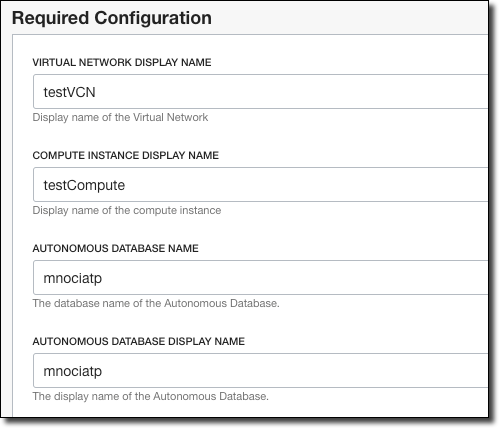
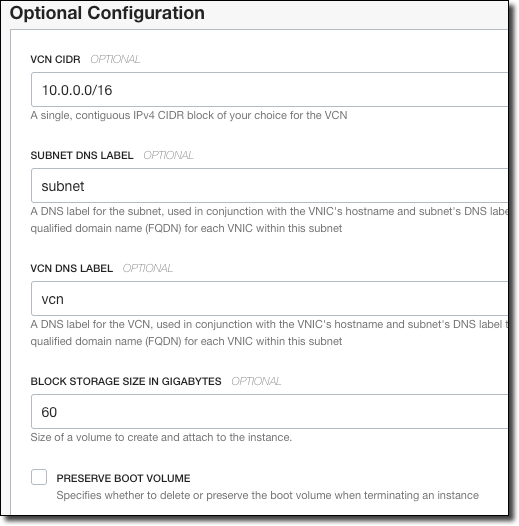
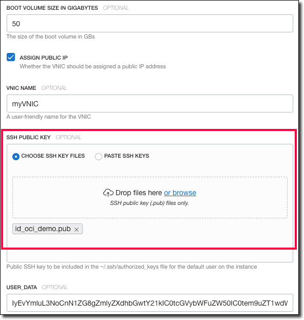
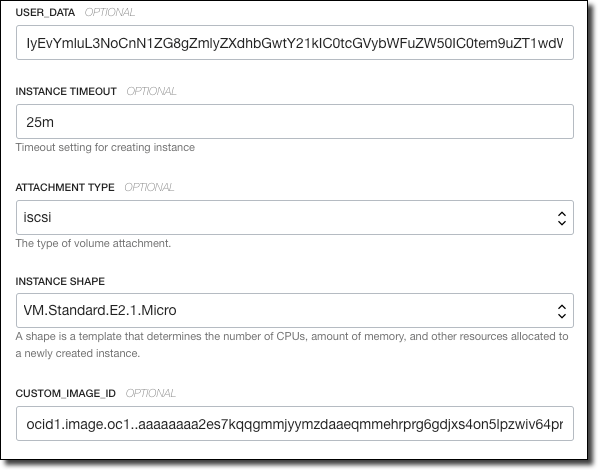

# Setup

## Create an SSH Keypair

For example:

```shell script
ssh-keygen -t rsa -N "" -b 2048 -C "id_oci" -f /path/to/id_oci
```

## Create Infrastructure

Download the latest Terraform configuration (stack.zip) from: 

https://github.com/recursivecodes/micronaut-data-jdbc-graal-atp/releases

Go to the Resource Manager:


Click 'Create Stack':


Choose 'My Configuration', and upload the configuration zip:


Enter name, description and choose the compartment, then click 'Next':


Accept the default data in this section:



And this section:



Upload your public SSH key:



Accept this data. Click 'Next', review and create your stack.



On the stack details page, click 'Terraform Actions' and select 'Plan'.


Review the plan output, ensure no failures.


Click 'Terraform Actions' and select 'Apply'.


Choose the plan you just created, then click 'Apply'.


Review the output, and collect the following values from the output:

* compartment_id
* tns_name
* autonomous_database_admin_password
* autonomous_database_schema_password
* autonomous_database_wallet_password
* atp_id
* vault_id
* key_id

## Create Secrets

From Cloud Shell, download the script, make it executable, and run it:

```shell script
wget https://raw.githubusercontent.com/recursivecodes/micronaut-data-jdbc-graal-atp/master/scripts/setup.sh
chmod +x setup.sh
./setup.sh
```

Enter the values that you copied from the TF output when prompted.

